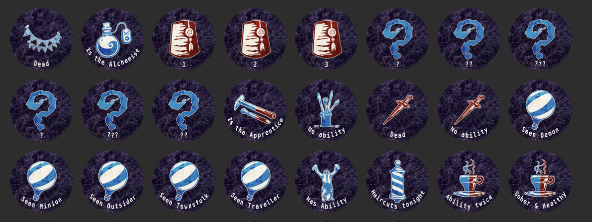

# Blood on the Clocktower - Token Maker

This project allows to create tokens to print and play Blood on the Clocktower. 

Token Examples:


Reminder Examples:


---
## Table of Contents

- [Features](#features)
- [Prerequisites](#prerequisites)
- [Setup Instructions](#setup-instructions)
- [Usage](#usage)
- [Contributing](#contributing)
- [License](#license)

---

## Features

To run a specific function, run the following (replacing PythonFileName with any of the feature functions): 
```bash
python {PythonFileName}.py
```

If running for the first time, it is recommended to run them using the following order:

- Feature 1: `get_assets_from_wiki.py`
    - This program scrapes the assets from the official wiki. 
    - Some links are hardcoded as they were not directly scappable 
    - The scrapper may become obsolete if there are changes to the urls of the wiki. If so, feel free to contact me so I can implement a fix. 
- Feature 2: `generate_tokens_and_reminders.py`
    - This will generate all tokens and all reminders for all characters
    - Background can be changed
    - Reminders listed in the characters.json
- Feature 3: `save_tokens_to_pdf.py`
    - This places all the tokens and reminders on a pdf to prepare from printing
- Feature 4: `generate_night_order_sheet.py`
    - Allow the creation of the night order sheets for first and other nights
    - Can be printed on A4, and folded in 2
---

## Prerequisites

Before setting up the project, ensure you have the following installed:

- **Python 3.10+**: Download from [python.org](https://www.python.org/downloads/)
- **Pip**: Comes with Python installation.
- (Optional) **Virtual Environment Tools**: `venv`, `virtualenv`, or `pipenv` (choose based on your project setup).

---

## Setup Instructions

Follow these steps to get the project running on your local machine:

### 1. Clone the Repository
```bash
git clone https://github.com/EhdiB/botc_token_generator.git
cd botc_token_generator
```

### 2. Set Up the Environment
#### Option A: Using setup.sh Script (Recommended)
We have a simple setup.sh script that automates setting up the virtual environment and installing dependencies. To use it:

Make sure the script is executable:

```bash
chmod +x setup.sh
```

Run the setup.sh script:
```bash
./setup.sh
```

The script will:
- Create a virtual environment called myenv.
- Activate the environment.
- Install dependencies from requirements.txt.


#### Option B: Manually Using virtualenv
If you prefer to set up the environment manually, you can follow these steps:

Create a virtual environment (you can replace botc_tokens_env by a preferred enviroment name):
```bash
python -m venv botc_tokens_env
```

Activate the virtual environment:
- Linux/Mac: source myenv/bin/activate
- Windows: .\myenv\Scripts\activate

Install the dependencies:
```bash
pip install -r requirements.txt
```

### 3. Run the Application
After setting up the environment and installing dependencies, start the application:

```bash
python programtorun.py
```


## Usage
Provide examples or instructions for how to use the project. Include code snippets if applicable:

```bash
python main.py --example-flag
```


## Contributing
Contributions are welcome! 

Follow these steps to contribute:
- Fork the repository.
- Create a new branch: git checkout -b feature-name.
- Commit your changes: git commit -m "Add some feature".
- Push to the branch: git push origin feature-name.
- Open a pull request.

## License
- [Blood on the Clocktower](https://bloodontheclocktower.com) is a trademark of Steven Medway and The Pandemonium Institute
- Scripts data are obtained from [BotC Scripts database](https://botc-scripts.azurewebsites.net)
- Detailed information about each official character is obtained from [Blood on the Clocktower Wiki](https://wiki.bloodontheclocktower.com).
- Some images were collected from [Clocktower.online](https://www.clocktower.online/)
- Information about night order, reminders and Jinxes was obtained from [Pocket Grimoire](https://www.pocketgrimoire.co.uk/)


## Questions or Issues?
If you encounter any issues or have questions, feel free to open an issue in the GitHub Issues section.